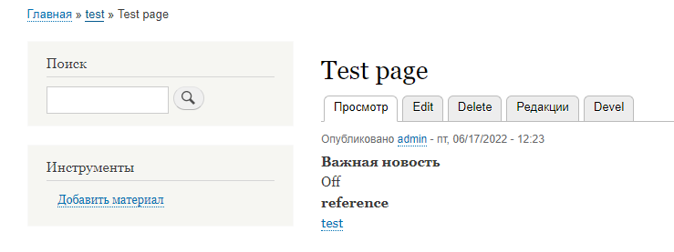

# Entity Reference Hierarchy

[link to page Entity Reference Hierarchy](https://www.drupal.org/project/entity_hierarchy)

## Info

> * Тип родительских материалов указывается в дополнительном поле типа Entity reference hierarchy; при создании необходим тип связи Entity hierarchy
>
> 
>
> 
>
> 
>
> 
>

> * Есть контекстные фильтры Hierarchy: Is Parent of, Hierarchy: Is child of; можно добавить связи:
>
> 
>
> 